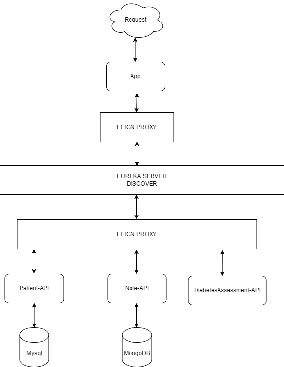

# p9_pagny_jerome - Projet Mediscreen
Application d'évaluation du diabète

---
## H2 Technologies
- Java 17
- maven 3.6.3
- jacoco 0.8.8
- springboot 2.7.4
- eureka server 3.1.4
- prometheus 2.39.1
- phpmyadmin 5.2.0
- mysql 8.0
- mongodb 6.0
- swagger 3
- thymeleaf 3.0.15

---
## Architecture

---
## Run application
- With docker :
`docker-compose up -d`

